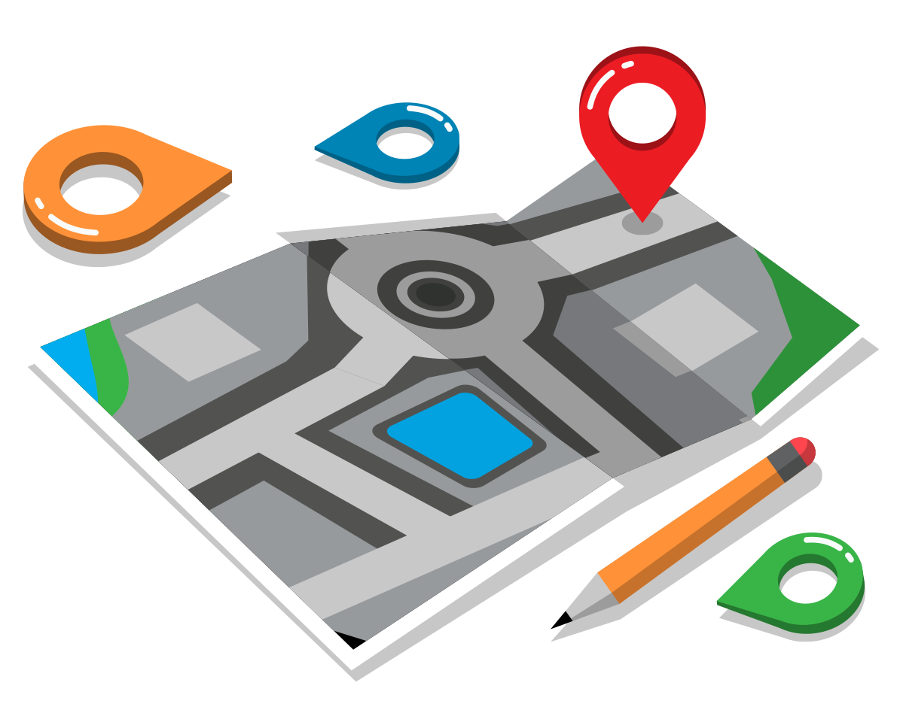

<a name="readme-top"></a>

[![Contributors][contributors-shield]][contributors-url]
[![Forks][forks-shield]][forks-url]
[![Stargazers][stars-shield]][stars-url]
[![Issues][issues-shield]][issues-url]
[![GPL-3.0 License][license-shield]][license-url]


<!-- PROJECT LOGO -->
<br />
<div align="center">
  <a href="https://github.com/cargonvis/optimal_accommodation_locator">
    
  </a>

<h3 align="center">OPTIMAL ACCOMMODATION LOCATOR</h3>

  <p align="center">
    This repository provides code for an intelligent accommodation locator that suggests the best location for your stay based on the places you plan to visit in your selected city. Enhance your travel experience by finding the optimal accommodation in proximity to your desired attractions.
    <br />
    <a href="https://github.com/cargonvis/optimal_accommodation_locator"><strong>Explore the docs »</strong></a>
    <br />
    <br />
    <a href="https://github.com/cargonvis/optimal_accommodation_locator">View Demo</a>
    ·
    <a href="https://github.com/cargonvis/optimal_accommodation_locator/issues">Report Bug</a>
    ·
    <a href="https://github.com/cargonvis/optimal_accommodation_locator/issues">Request Feature</a>
  </p>
</div>


<!-- TABLE OF CONTENTS -->
<details>
  <summary>Table of Contents</summary>
  <ol>
    <li>
      <a href="#about-the-project">About The Project</a>
      <ul>
        <li><a href="#built-with">Built With</a></li>
      </ul>
    </li>
    <li>
      <a href="#getting-started">Getting Started</a>
      <ul>
        <li><a href="#prerequisites">Prerequisites</a></li>
        <li><a href="#installation">Installation</a></li>
      </ul>
    </li>
    <!-- <li><a href="#usage">Usage</a></li> -->
    <!-- <li><a href="#roadmap">Roadmap</a></li> -->
    <li><a href="#future-improvements">Future Improvements</a></li>
    <li><a href="#contributing">Contributing</a></li>
    <li><a href="#license">License</a></li>
    <li><a href="#contact">Contact</a></li>
    <!-- <li><a href="#acknowledgments">Acknowledgments</a></li> -->
  </ol>
</details>


<!-- ABOUT THE PROJECT -->
## About The Project

<!-- [![Product Name Screen Shot][product-screenshot]](https://example.com) --> 
![Product Name Screen Shot][product-screenshot] <!-- Image without link -->

The project aims to simplify the process of finding suitable accommodations during travel by utilizing advanced algorithms to suggest optimal locations based on user preferences and the proximity to key attractions. By integrating various data sources and leveraging intelligent recommendations, users can make informed decisions and enhance their overall travel experience.

<p align="right">(<a href="#readme-top">back to top</a>)</p>


### Built With

* [![Python][Python.org]][Python-url]
* [![Jupyter][Jupyter.org]][Jupyter-url]
* [![Folium][Folium.org]][Folium-url]
* [![Pandas][Pandas.org]][Pandas-url]
* [![Scikit-learn][Scikit-learn.org]][Scikit-learn-url]

<p align="right">(<a href="#readme-top">back to top</a>)</p>


<!-- GETTING STARTED -->
## Getting Started

To get started with this project, follow the steps below:

### Prerequisites

Run the following command to install the necessary libraries:
* install.sh
  ```
  ./install.sh
  ```

### Installation

1. Get a free Geoapify API key from [Geoapify website](https://myprojects.geoapify.com/register)
2. Clone the repo:
   ```
   git clone https://github.com/cargonvis/optimal_accommodation_locator.git
   ```
3. Open Jupyter and run the code:
   ```
   jupyter lab main.ipynb
   ```
4. Replace Variables:
   In the code, replace the following variables at the top:
  - NAME_OF_PROJECT_IN_GEOAPIF_API: Replace with the name you chose for your project when creating your Geoapify API key.
	- GEOAPIFY_API_KEY: Replace with your Geoapify API key.

In the code, replace the following variables at the top:
	- IATA_ICAO_API_KEY: Replace with your IATA and ICAO API key.
	- KIWI_API_KEY: Replace with your KIWI API key.
	- SENDER_EMAIL: Replace with the sender email address.
	- RECEIVER_EMAIL: Replace with the receiver email address.
	- APP_PASSWORD: Replace with the app password generated for the sender email.

<p align="right">(<a href="#readme-top">back to top</a>)</p>


<!-- USAGE EXAMPLES -->
<!--## Usage

Use this space to show useful examples of how a project can be used. Additional screenshots, code examples and demos work well in this space. You may also link to more resources.

_For more examples, please refer to the [Documentation](https://example.com)_-->

<!-- <p align="right">(<a href="#readme-top">back to top</a>)</p> -->


<!-- ROADMAP -->
<!--## Roadmap

- [ ] Feature 1
- [ ] Feature 2
- [ ] Feature 3
    - [ ] Nested Feature-->

See the [open issues](https://github.com/cargonvis/optimal_accommodation_locator/issues) for a full list of proposed features (and known issues).

<p align="right">(<a href="#readme-top">back to top</a>)</p>


<!-- FUTURE IMPROVEMENTS -->
## Future Improvements

- Implement automatic search of most famous touristic attractions depending on the city

<p align="right">(<a href="#readme-top">back to top</a>)</p>


<!-- CONTRIBUTING -->
## Contributing

Contributions are what make the open source community such an amazing place to learn, inspire, and create. Any contributions you make are **greatly appreciated**.

If you have a suggestion that would make this better, please fork the repo and create a pull request. You can also simply open an issue with the tag "enhancement".
Don't forget to give the project a star! Thanks again!

1. Fork the Project
2. Create your Feature Branch (`git checkout -b feature/AmazingFeature`)
3. Commit your Changes (`git commit -m 'Add some AmazingFeature'`)
4. Push to the Branch (`git push origin feature/AmazingFeature`)
5. Open a Pull Request

<p align="right">(<a href="#readme-top">back to top</a>)</p>


<!-- LICENSE -->
## License

Distributed under the GNU General Public License v3.0. See `LICENSE` for more information.

<p align="right">(<a href="#readme-top">back to top</a>)</p>


<!-- CONTACT -->
## Contact

[![Email][Email-shield]][Email-url] [![LinkedIn][linkedin-shield]][linkedin-url] [![Discord][Discord-shield]][Discord-url]

Project Link: [https://github.com/cargonvis/optimal_accommodation_locator](https://github.com/cargonvis/optimal_accommodation_locator)

<p align="right">(<a href="#readme-top">back to top</a>)</p>


<!-- ACKNOWLEDGMENTS -->
<!--## Acknowledgments

* []()
* []()
* []()-->

<!-- <p align="right">(<a href="#readme-top">back to top</a>)</p> -->


<!-- MARKDOWN LINKS & IMAGES -->
<!-- https://www.markdownguide.org/basic-syntax/#reference-style-links -->
[contributors-shield]: https://img.shields.io/github/contributors/cargonvis/optimal_accommodation_locator.svg?style=for-the-badge
[contributors-url]: https://github.com/cargonvis/optimal_accommodation_locator/graphs/contributors
[forks-shield]: https://img.shields.io/github/forks/cargonvis/optimal_accommodation_locator.svg?style=for-the-badge
[forks-url]: https://github.com/cargonvis/optimal_accommodation_locator/network/members
[stars-shield]: https://img.shields.io/github/stars/cargonvis/optimal_accommodation_locator.svg?style=for-the-badge
[stars-url]: https://github.com/cargonvis/optimal_accommodation_locator/stargazers
[issues-shield]: https://img.shields.io/github/issues/cargonvis/optimal_accommodation_locator.svg?style=for-the-badge
[issues-url]: https://github.com/cargonvis/optimal_accommodation_locator/issues
[license-shield]: https://img.shields.io/github/license/cargonvis/optimal_accommodation_locator.svg?style=for-the-badge
[license-url]: https://github.com/cargonvis/optimal_accommodation_locator/blob/master/LICENSE
[product-screenshot]: images/project_image.png
[Python.org]: https://img.shields.io/badge/python-blue?style=for-the-badge&logo=python&logoColor=white
[Python-url]: https://python.org/
[Jupyter.org]: https://img.shields.io/badge/Jupyter-F37626.svg?logo=Jupyter&style=for-the-badge&logoColor=white
[Jupyter-url]: https://jupyter.org/
[Folium.org]: https://img.shields.io/badge/Folium-darkgreen?style=for-the-badge&logo=folium&logoColor=white
[Folium-url]: https://python-visualization.github.io/folium/
[Pandas.org]: https://img.shields.io/badge/Pandas-black?logo=pandas&style=for-the-badge&logoColor=white
[Pandas-url]: https://pandas.pydata.org/
[Scikit-learn.org]: https://img.shields.io/badge/Scikit%20learn-orange?logo=Scikitlearn&style=for-the-badge&logoColor=white
[Scikit-learn-url]: https://scikit-learn.org/
[Email-shield]: https://img.shields.io/badge/gmail-red?style=for-the-badge&logo=gmail&logoColor=white
[Email-url]: mailto:cgonv1993@gmail.com
[linkedin-shield]: https://img.shields.io/badge/linkedin-blue?style=for-the-badge&logo=linkedin&logoColor=white
[linkedin-url]: https://linkedin.com/in/carlosgonzalezvisiedo
[Discord-shield]: https://img.shields.io/badge/discord-darkblue?style=for-the-badge&logo=discord&logoColor=white
[Discord-url]: https://discordapp.com/users/439897699299491850